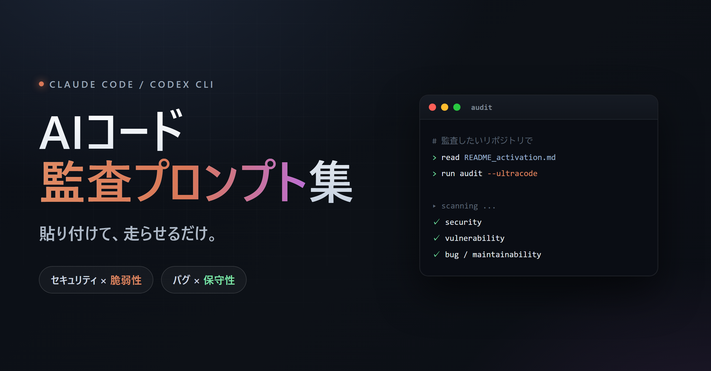

<!-- Language: [日本語](README.md) | English -->

<p align="center">
  
</p>

# AI Code Audit Prompts

A collection of paste-ready prompts for getting AI agents (Claude Code / Codex CLI, etc.) to perform "security, vulnerability, bug, and maintainability audits, plus fixes that don't break existing behavior." Only project-agnostic, reusable templates live here.

## What this is

- A set of prompts in `docs/`, picked by tool (Claude / Codex) and DB category (with DB / without DB), for running heavy code audits.
- Every prompt shares the same premises: "no builds, commits, production DB operations, or sweeping rewrites," "run all the way through without stopping," and "record anything that needs a human decision and move on."
- The invariants that all prompts must uphold are canonicalized in [docs/README_invariants.md](docs/README_invariants.md).
- This prompt collection comes with no warranty. AI audits can produce false positives and misses. Always have a human review the results — including confirmed findings — before applying them to production. Use at your own risk.

## How to use

### 1. Clone this repository

```
git clone <URL of this repository> ai-audit-prompts
```

You can put it anywhere (it doesn't depend on any specific local path).

### 2. In the project you want to audit, give the AI the following prompt

Replace `<repo>` with the path where you cloned this repo.

For Claude Code (have it read this repo's activation rules and auto-select):

```
Read <repo>/docs/README_activation.md, follow its auto-selection rules,
pick the claude_ultracode audit prompt best suited to this repository,
and execute exactly as written. Auto-detect the DB category. Use ultracode.
```

For Codex CLI:

```
Read <repo>/docs/README_activation.md, follow its auto-selection rules,
pick the codex audit prompt (codex_audit_*.md) best suited to this repository,
and execute exactly as written. Auto-detect the DB category.
```

- You don't need to name the file directly; the activation rules auto-select by tool × DB category.
- To set the DB category yourself, change the tail to "use DB category: with DB" or "without DB."
- The trailing `ultracode` in the Claude version is a switch for multi-agent parallelism. Drop it when you want a lighter run.
- Reports come back in the language you use — ask in English and you get English, ask in Japanese and you get Japanese. No translation needed.

### 3. (Optional) Plant a keyword in the project

If writing the path every time is tedious, add the snippet below to the target project's `CLAUDE.md` (or `AGENTS.md` for Codex) so it launches just by saying "run audit." See the "Instructions to put in each project" section of [docs/README_activation.md](docs/README_activation.md) for details.

## Directory layout

```
docs/
  README_activation.md        ← auto-selection rules for which prompt to use (read first)
  README_naming.md            ← file naming scheme
  README_invariants.md        ← invariants kept consistent across all prompts (canonical)
  claude_ultracode_audit_db_app.md       ← Claude / with DB
  claude_ultracode_audit_db_less_app.md  ← Claude / without DB
  codex_audit_db_app.md                  ← Codex / with DB
  codex_audit_db_less_app.md             ← Codex / without DB
```

The codex versions are detailed/enumerated while the claude_ultracode versions are condensed — the granularity differs, but the invariants they enforce (forbidden operations, preserving current behavior, masking secrets, human-review-before-applying, etc.) are identical and canonicalized in [docs/README_invariants.md](docs/README_invariants.md).

## What does NOT belong here (important)

This is for reusable templates only. The following must **never be committed** (`.gitignore` guards against it, but enforce it operationally too):

- Credentials, secrets, API keys, tokens, private keys, passwords
- Internal/engagement-specific information such as server configs, IPs, hostnames, or customer names
- Investigation notes, logs, plans, or result reports for specific projects

The line this repo draws: keep only the "method" of how to run an audit.
