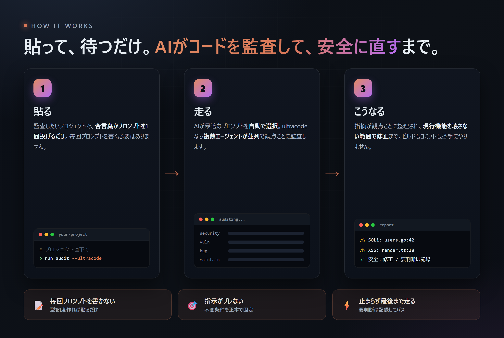

<!-- Language: 日本語 | [English](README.en.md) -->

<p align="center">
  
</p>

# AI コード監査プロンプト集

AI エージェント（Claude Code / Codex CLI 等）に「セキュリティ・脆弱性・バグ・保守性の監査と、現行機能を壊さない範囲の修正」をやらせるための、貼り付け用プロンプト集です。プロジェクトに依存しない汎用テンプレートだけを置きます。

## なぜ作ったか

AI にコード監査をやらせたい——脆弱性もバグも保守性も見て、現行機能を壊さない範囲で直してほしい。やりたいことは毎回同じなのに、**毎回プロンプトをゼロから書いていました**。しかも書くたびに指示が微妙にブレる。

- 「ビルドするな」と書き忘れて、勝手にコミットされかけた
- 途中で「これ直していいですか？」と止まったまま放置された
- 観点を並べ忘れて、SQLi だけ見て認可漏れを見落とした
- 「最後まで走って」と言い忘れて、序盤で満足して止まられた

毎回これを思い出して書くのが面倒で、書いても抜けが怖い。だったら**監査のやり方そのものを固めてしまえばいい**——というのがこのリポジトリです。貼って走らせれば、止まらず最後まで・観点を漏らさず・現行機能を壊さない範囲で、修正まで一気にやり切ります。毎回プロンプトを考える時間と、指示のブレが消えます。

## これは何か

- 重いコード監査を、ツール（Claude / Codex）と DB 区分（DB あり / なし）に応じて使い分けるためのプロンプトを `docs/` にまとめたもの。
- 各プロンプトは「ビルド・コミット・本番DB操作・抜本改修は禁止」「止まらず最後まで走り切る」「判断待ちは記録してパス」を共通の前提にしています。
- 全プロンプトが守るべき不変条件は [docs/README_invariants.md](docs/README_invariants.md) を正本とします。
- 本プロンプト集は無保証です。AI による監査は誤検出・検出漏れがあり得ます。確定 finding も含め、本番反映前に必ず人間がレビューしてください。利用は自己責任で。

## 使い方

<p align="center">
  
</p>

### 1. このリポジトリを clone する

```
git clone <このリポジトリのURL> ai-audit-prompts
```

置き場所はどこでも構いません（特定のローカルパスに依存しません）。

### 2. 監査したいプロジェクトで、AI に次のプロンプトを投げる

clone した先のパスを `<repo>` に読み替えてください。

Claude Code 用（ultracode・多エージェント並列）:

```
<repo>/docs/README_activation.md を読んで、claude_ultracode 版の監査プロンプトを選んで実行して。ultracode で。
```

引数を絞りたい場合:

```
<repo>/docs/README_activation.md を読んで、claude_ultracode 版の監査プロンプトを選んで実行して。ultracode で。
DB区分: あり
強度: ミッド
スコープ: 調査まで
観点: セキュリティ・脆弱性
対象: src/api/
除外: src/api/tests/
```

Claude Fable 用（深い推論・単一エージェント）:

```
/model claude-fable-5
```

モデルを切り替えてから、次のプロンプトを投げてください。

**簡易版（全デフォルト）:**

```
<repo>/docs/README_activation.md を読んで、claude_fable 版の監査プロンプトを選んで実行して。DB区分は自動判定でいい。
```

**詳細版（引数を絞る場合の例）:**

```
<repo>/docs/README_activation.md を読んで、claude_fable 版の監査プロンプトを選んで実行して。
DB区分: あり
強度: ミッド
スコープ: 調査まで
観点: セキュリティ・脆弱性
対象: src/api/
除外: src/api/tests/
```

引数はすべて省略可能です（DB区分は自動判定、他はデフォルト値で動きます）。「まずざっと見たい」なら簡易版、「認可まわりだけ深く調べたい」なら詳細版の使い分けがおすすめです。

Codex CLI 用:

```
<repo>/docs/README_activation.md を読んで、codex 版の監査プロンプトを選んで実行して。
```

引数を絞りたい場合:

```
<repo>/docs/README_activation.md を読んで、codex 版の監査プロンプトを選んで実行して。
DB区分: あり
強度: ミッド
スコープ: 調査まで
観点: セキュリティ・脆弱性
対象: src/api/
除外: src/api/tests/
```

- ファイル名を直接指定しなくても、起動ルールがツール×DB区分を自動選択します。
- `DB区分: あり / なし` を明示すると自動判定をスキップします。省略時は自動判定。
- Claude 版末尾の `ultracode` は多エージェント並列のスイッチ。軽く済ませたい時は外す。
- 監査結果は、あなたが話しかけた言語で返ります（英語で頼めば英語、日本語なら日本語）。翻訳の手間はありません。

### 2-b. 稼働サーバーを診断したい場合（完全 read-only）

リポジトリではなく、SSH でアクセスできる稼働中サーバーの脆弱性・設定不備を診断し、対策を提言させたい場合は、サーバー診断プロンプトを起動します。サーバーの状態は一切変更せず、対策は提言のみ（適用は人間）です。

Claude Code（ultracode・並列）でサーバー診断:

```
<repo>/docs/README_activation.md を読んで、claude_ultracode 版のサーバー診断プロンプトを選んで実行して。ultracode で。
接続方法: AI接続
接続先: user@example.com
```

Claude Fable でサーバー診断:

```
/model claude-fable-5
```

```
<repo>/docs/README_activation.md を読んで、claude_fable 版のサーバー診断プロンプトを選んで実行して。
接続方法: AI接続
接続先: user@example.com
強度: ミッド
観点: SSH設定・ネットワーク・公開サービス・ファイアウォール
```

Codex CLI でサーバー診断:

```
<repo>/docs/README_activation.md を読んで、codex 版のサーバー診断プロンプトを選んで実行して。
接続方法: AI接続
接続先: user@example.com
```

- 既に対象サーバー上で Claude Code を動かしているなら `接続方法: サーバー上`（このとき接続先は不要）。
- 引数は省略可能（接続方法はAI接続、強度ハイ、観点は全部がデフォルト）。ただし AI接続では接続先が必要です。
- **自分が管理する／診断の許可を得たサーバーにのみ使ってください。** サーバーの状態は変えず、対策の適用は必ず人間がレビューしてから行ってください。

### 3.（任意）プロジェクトに合言葉を仕込む

毎回パスを書くのが面倒なら、対象プロジェクトの `CLAUDE.md`（Codex 用は `AGENTS.md`）に下記を入れておくと、「run audit」と言うだけで起動します。詳細は [docs/README_activation.md](docs/README_activation.md) の「各プロジェクトに書く指示」を参照。

## ディレクトリ構成

```
docs/
  README_activation.md        ← どのプロンプトを使うかの自動選択ルール（最初に読む）
  README_naming.md            ← ファイル命名スキーム
  README_invariants.md        ← コード監査プロンプトで揃える不変条件（正本）
  README_invariants_server.md ← サーバー診断プロンプトで揃える不変条件（正本）
  claude_ultracode_audit_db_app.md       ← Claude ultracode / コード監査 / DBあり
  claude_ultracode_audit_db_less_app.md  ← Claude ultracode / コード監査 / DBなし
  claude_fable_audit_db_app.md          ← Claude Fable / コード監査 / DBあり
  claude_fable_audit_db_less_app.md     ← Claude Fable / コード監査 / DBなし
  codex_audit_db_app.md                  ← Codex / コード監査 / DBあり
  codex_audit_db_less_app.md             ← Codex / コード監査 / DBなし
  claude_ultracode_audit_server.md       ← Claude ultracode / サーバー診断（read-only）
  claude_fable_audit_server.md           ← Claude Fable / サーバー診断（read-only）
  codex_audit_server.md                  ← Codex / サーバー診断（read-only）
```

監査は 2 系統あります。**コード監査**（リポジトリのセキュリティ・脆弱性・バグ・保守性を見て、現行機能を壊さない範囲で修正まで）と、**サーバー診断**（SSH でアクセスできる稼働中サーバーを完全 read-only で診断し、対策を提言）です。

codex 版は詳細列挙型、claude_ultracode 版は凝縮型（並列ファンアウト）、claude_fable 版は単一エージェント深い推論型で粒度が異なりますが、各系統で守る不変条件は同じで、コード監査は [docs/README_invariants.md](docs/README_invariants.md)、サーバー診断は [docs/README_invariants_server.md](docs/README_invariants_server.md) で正本管理しています。

### サーバー診断について（重要）

サーバー診断プロンプト（`*_audit_server.md`）は、コード監査とは安全境界が異なります。

- **完全 read-only**: 稼働サーバーの状態を一切変更しません（設定変更・サービス再起動・パッケージ更新・ファイアウォール変更・ユーザー変更・再起動は禁止）。発見した問題の対策は提言として報告するだけで、**適用は人間が行います**（本番障害・SSH ロックアウトを避けるため）。
- **接続方法は引数で選択**: 既定は「AI接続」（AI がローカルから `ssh <接続先> '<read-onlyコマンド>'` で診断）。既にサーバー上で Claude Code が動いているなら「サーバー上」を指定。
- SSH・ファイアウォールの提言にはロックアウト回避手順が必ず添えられます。
- あくまで自己責任で、**自分が管理する／診断の許可を得たサーバー**にのみ使ってください。

## このリポジトリに置かないもの（重要）

汎用テンプレート専用です。次は**絶対にコミットしない**（`.gitignore` で予防していますが、運用でも徹底）:

- 認証情報・secrets・APIキー・トークン・秘密鍵・パスワード
- サーバー構成・IP・ホスト名・顧客名などの社内/案件固有情報
- 特定プロジェクトの調査メモ・ログ・plan / 結果報告 md

監査の「進め方（メソッド）」だけを置く、というのが本リポジトリの線引きです。
