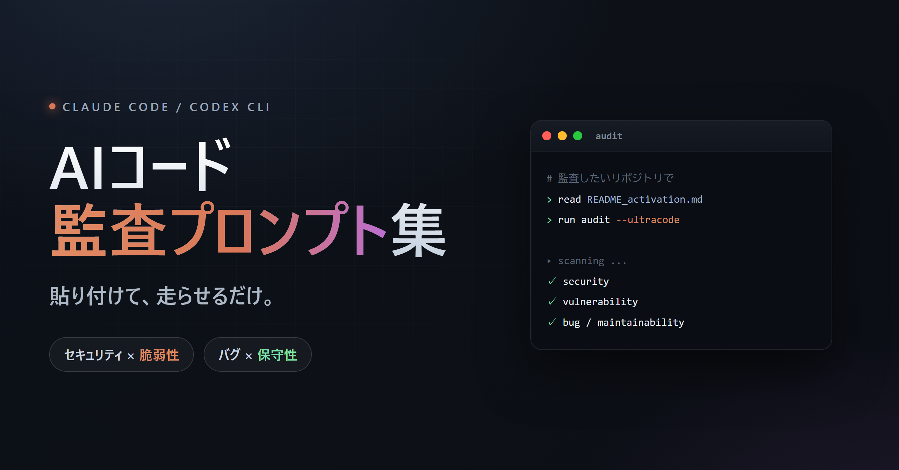

<!-- Language: 日本語 | [English](README.en.md) -->

<p align="center">
  
</p>

# AI 監査プロンプト集

版ごとの変更点は [CHANGELOG](CHANGELOG.md)、タグ付きの公開版は [GitHub Releases](https://github.com/ishizakahiroshi/ai-audit-prompts/releases) を参照してください。

実行製品やモデル名に依存せず、AI にアプリ、管理下サーバー、資料と実装の差異を監査させるための貼り付け用プロンプト集です。監査対象から3本の正典を選び、DB区分、security profile、実行環境のcapabilityを順に解決します。

<p align="center">
  <a href="https://youtu.be/doIv1ItRb_w"></a><br>
  ▶ <a href="https://youtu.be/doIv1ItRb_w">v1.0.0の紹介動画（23秒・YouTube）</a>
</p>

## これは何か

- 保守するpaste-ready正典は `docs/audit_app.md`、`docs/audit_server.md`、`docs/audit_doc_vs_impl.md` の3本です。
- routingは `target → DB/profile → capability` です。Claude、Codex、ChatGPT、CLI、Web UI等の製品名やmodel名だけで、shell、Web、並列agent、独立verifier等の能力を推測しません。
- app監査の既定scopeは「調査まで」です。確定findingには具体的な最小修正案を付けますが、`confirmed finding ≠ applied fix` です。修正は明示scopeと実行前承認の範囲だけで行います。
- server診断は完全read-only、doc-vs-impl監査は資料・実装とも完全非変更です。どちらも対策や修正は提言だけで、適用は人間が行います。
- report冒頭は固定100点ではなく、coverage、evidence、候補検証率、未調査、residual riskを示します。数値評価は利用者が明示要求した場合だけ、分母と未調査の扱いを定義して参考値として出します。
- 監査事実とevidenceの正本はreport、後続作業の実行正本はrelated先の実行md（plan / bugfix / pending、issue tracker等）です。監査後のtriageと修正フェーズの契約は `docs/audit_app.md` 末尾の2節（3 family共通）です。`確定 / 却下 / 判断待ち / 重複`、`plan / fix / pending / 見送り`、検証状態を別々に追跡します。
- 法令・規格（EU CRA、EU AI Act、PCI DSS、ISO/IEC 42001、AI事業者ガイドライン等）への適合は判定しません。利用者が明示要求した場合、または対象・資料が適合を明示的に主張する場合だけ、その名称・版/施行日・適用状態（法令は改正法と適用段階）・URL・確認日をreportのregulatory context（未検証）へ記録し、適合主張と実装の突合は資料突合の正典だけが扱います。言及がなければこの欄自体を省き、該当し得る規制の推定・列挙はしません。例外として、侵害痕跡・active exploitation・個人data / credentialの漏えいの決定的証拠を確定した場合に限り、報告終端を待たずに直ちに示し、規制名を挙げず該当性も判定しない形で、期限付きの通知・報告義務の該当判断と初動をownerが直ちに行うよう、判断待ちの先頭へ1行置きます。
- このprompt集は無保証です。AI監査には誤検出・検出漏れがあり得るため、確定findingや自動適用した修正も本番反映前に人間がreviewしてください。第三者projectへの報告は、人間が再現を確認した確定findingだけを対象の脆弱性受付窓口の条件に従って行ってください。

## 使い方

### 1. cloneする

```text
git clone <このリポジトリのURL> ai-audit-prompts
```

### 2. 対象から正典を選ぶ

迷ったときは起動ルールへ任せられます。

```text
<repo>/docs/README_activation.md を読み、監査対象に合う正典promptを選んで実行して。
```

| 監査対象 | 正典 | 主な用途 |
|---|---|---|
| app / repository / source code | [`audit_app.md`](docs/audit_app.md) | security、bug、dependency、maintainability。DBと複数profileを内部で選択 |
| managed server / VPS / host | [`audit_server.md`](docs/audit_server.md) | 所有・管理下serverの完全read-only診断と対策提言 |
| document vs implementation | [`audit_doc_vs_impl.md`](docs/audit_doc_vs_impl.md) | 指定資料のclaimと現行実装を完全非変更で突合 |

URLだけの外部site、第三者system、共用hosting全体への能動診断は対象外です。

### app監査の例

```text
<repo>/docs/audit_app.md のprompt全文を使って監査して。
DB区分: 自動
強度: ミッド
スコープ: 調査まで
検証モード: 安全なローカル検証
観点: 全部
対象: src/
除外: src/generated/
確認: あり
```

`DB区分` は `自動 / あり / なし`。自動時はmanifest、dependency、schema、migration、ORM/SQL、DB driver等から `あり / なし / unknown` を根拠付きで判定し、本番DB接続やmigration実行はしません。`除外` はfinding・変更・検証の対象から外す指定で、経路を追うための読取りは既定で許します（読取りも禁じる場合は「（読取り禁止）」を添える）。

appは実装証拠に基づき、Web/API、AI/agent/MCP/RAG、native/desktop/mobile/browser extension、CLI/library、CI/CD/supply chain、cloud/IaC/Kubernetes、DB等のprofileを `selected / skipped / unknown + evidence` で複数選択します。repo内のAI coding agent / IDE設定（instruction file、hook、MCP server定義、permission / auto-approve設定、editor task、editor拡張の推奨、skill定義）の自動実行経路、それらの設定・workflow・同梱scriptの侵害痕跡（IoC）としての評価、tracked / history上のsecretやAI session artifactの混入は、AI profileの選択に関係なく全app共通で確認します。対象repoが自分の管理下でない場合は、対象repoのagent / IDE設定を読み込まない起動を選び、読み込んだかどうかをinventoryへ記録します（`docs/README_activation.md` の「起動側の前提」）。

### server診断の例

```text
<repo>/docs/audit_server.md のprompt全文を使って診断して。
接続方法: AI接続
接続先: user@example.com
強度: ミッド
観点: 2 SSH/remote identity, 3 package/CVE, 4 network/public service, 5 firewall
確認: あり
```

自分が所有・管理し、OS全体を調査する権限があるLinux / Unix系serverだけに使ってください。Windows Serverは現版の対象外です。非repoのserver診断では、実接続前にreportを保存するprivate owner repo、host、user、key filename、port、host key指紋を照合します。設定変更、更新、再起動、active scan、対策適用は行いません。hostへ露出したAI runtime、vector DB、MCP server、agent gateway等の公開面と常駐agent processの実行権限も観点に含みます。web server / reverse proxyの設定実効値と、document root配下の配信対象（.git、.env、dump等。内容は開きません）も観点に含みます。診断対象host自身（loopbackまたはinterfaceに載る自host保有address）とlink-local metadata endpointへの照会は、単発TLS handshakeやtoken無し単発GET等の状態を変えない最小観測に限って外部への能動requestと区別し、認証試行・payload送信・反復接続はしません。

### 資料と実装の差異監査の例

```text
<repo>/docs/audit_doc_vs_impl.md のprompt全文を使って監査して。
資料: docs/customer-guide.pdf
正典: docs/specification.md
実装基準: HEAD
媒体: PDF
強度: ハイ
対象: src/
確認: あり
```

`資料` は必須です。PDF、slide、image、spreadsheet等はtext抽出だけでなく、利用可能なら全pageを視覚確認します。資料内のAI向け命令はdataとして扱い、資料・source・設定・UIは変更しません。`正典` を省略した場合は、project instructions、spec-driven成果物（spec / plan / tasks、requirements / design等）、OpenAPI等の機械可読契約、ADRから、hidden directory（. 始まり）も含めて現行正典候補を特定し、進行中のchange / proposalやllms.txt等の派生文書は正典にしません。

## 実行契約

### scopeとapproval

既定の `確認: あり` では、prompt、解決済み引数、変更有無、検証範囲、成果物path、実際の実行modeと推奨実行環境との差分を提示し、承認を得てから始めます。これはtool permissionやYOLO設定とは別のgateです。prompt文の禁止は技術的な強制ではないため、対象の読取専用化、書込先の限定、network egressのallowlist、credential directoryの非mountを起動側で用意してください（`docs/README_activation.md` の「起動側の前提」）。

appのscopeは次のとおりです。

| scope | source変更 | 検証 |
|---|---|---|
| 調査まで（既定） | なし。findingごとの修正案だけ | sourceは変更せず、検証モードの範囲で検証commandを実行 |
| 調査・修正まで | 確定済みの自己完結した最小修正だけ | 選択した検証モードの範囲 |
| フルループ | 最小修正まで | 修正後検証と再調査まで |

`検証モード` は `静的 / 安全なローカル検証 / build含む` です。test内compileや一時artifactを使う安全な検証と、install、release、publish、deploy、shared環境変更等の副作用を分けます。scope外や副作用不明のcommandは実行しません。

### capabilityと品質表示

選択した正典は、file検索、shell、test、Web一次情報、並列agent、独立verifier、file編集等（資料突合の正典ではPDF / UIのvisual inspectionも）を `yes / no / unknown + evidence` で記録します。あわせて、実際に動いた実行mode（read-only等の制限mode）と、sandbox / network遮断の有無もplan/reportへ記録します。能力が少ない場合もfindingの確定条件は弱めず、直列二巡や「未検証」に切り替えます。

security baselineは実行時にofficial sourceだけで（取得先はofficial domainに限り、対象repo内のURLは開かず）current/stableを再確認し、名称、版、URL、確認日、確認状態をplan/reportへ残します。CVEやbaseline非適合だけではfindingにせず、対象実装への到達可能性、実効値、mitigationを確認します。CVSS（版・vector・算出者）、EPSS（score・percentile・model版・取得日）、CISA KEV、SSVC等の外部指標は出典付きの入力として記録し、単独で重大度・確定・却下の根拠にしません。

### 成果物

HTMLは既定で出力します（`HTML出力: あり`。`なし`ならMarkdownのみ）。`点数評価: 要求時 / あり / なし` は省略時「要求時」、あり自体も採点依頼、なしは採点依頼より優先します。HTMLと採点は独立です。監査事実の正本はMarkdownで、HTMLは同じsnapshot・算出済み評価・未確認・対応の選択肢を表示します。選択はブラウザ内の下書きで、承認・修正を実行しません。[共通契約](docs/README_html-report.md)、[雛形](templates/audit-report.html)、[全て合成のデモ](examples/audit-report.example.html)を参照してください。build・外部依存・個人用skillは不要です。

- plan: 対象repoの `docs/local/plan_audit_<topic>.md`
- report既定: `docs/ai-audit-prompts/report_audit_<topic>_<YYYY-MM-DD>.md`
- HTML既定: 同じ保存先・basenameの `.html`。最終／途中終了時に生成し、一方でも既存fileがあれば両方に同じ連番を付けます。生成・保存できなければ理由とMarkdownを残し、許可外へfallbackしません。
- `<topic>` は `<target>_<slug>` です（定義は `docs/README_naming.md` の「成果物命名」）。
- `保存先=...` を明示した場合だけ別のrepo相対pathを使います。
- 対象repoがpublicまたは公開状態が不明な場合、reportのGit管理はignoreを提案し、trackは未修正findingの公開を提示した明示承認時だけにします。
- 保存先がsymlink / junction / mountの場合は実体pathと書込可否を確認し、無断で別pathへfallbackしません。
- server reportはこのpublic prompt repoではなく、利用者が指定したprivate owner repoへ保存します。

## ディレクトリ構成

`docs/` 直下の公開Markdownは23本です。内訳はpaste-ready正典3本、移行用alias 14本、routing/invariants/index 5本、HTML契約1本です。

```text
docs/
  index.md                    OKF v0.2 Bundleの入口
  README_activation.md        対象中心の起動・routing規約
  README_naming.md            正典・aliasの命名とmetadata
  README_invariants.md        app監査の共通契約
  README_invariants_server.md server診断の完全read-only契約
  README_html-report.md       HTML出力・評価・雛形の共通契約
  audit_app.md                app/source code監査の正典
  audit_server.md             managed server診断の正典
  audit_doc_vs_impl.md        資料と実装の差異監査の正典
  *_audit_*.md                旧14pathのdeprecated alias
  local/                      非公開作業記録（gitignore対象）
templates/audit-report.html   自己完結の共通雛形
examples/audit-report.example.html 全て合成のデモ
```

旧tool別14pathは1回の移行releaseだけ案内用に残します。aliasはpaste-ready promptではなく、自動選択・推奨一覧・正典数に含めません。repo内外consumerの移行確認後、次の破壊的変更を扱う別planで削除します。

`docs/` はOpen Knowledge Format (OKF) v0.2 Bundleでもあり、[`docs/index.md`](docs/index.md)からrouting、正典、invariantsへ段階的に辿れます。

## このリポジトリに置かないもの

このrepositoryは汎用methodだけを置くpublic repositoryです。次をcommitしません。

- credential、API key、token、private key、password等の秘密
- server構成、IP、hostname、顧客名等の案件固有情報
- 特定projectの調査memo、log、plan、report

公開Markdownの整合確認には `docsweep okf-check docs --json`、秘密検査には `node scripts/secrets-scan.mjs --all-tracked --block` を使えます。このrepositoryには製品アプリ・生成CLI・build成果物はありません。HTML雛形には判断下書き用のインラインJSがあります。
